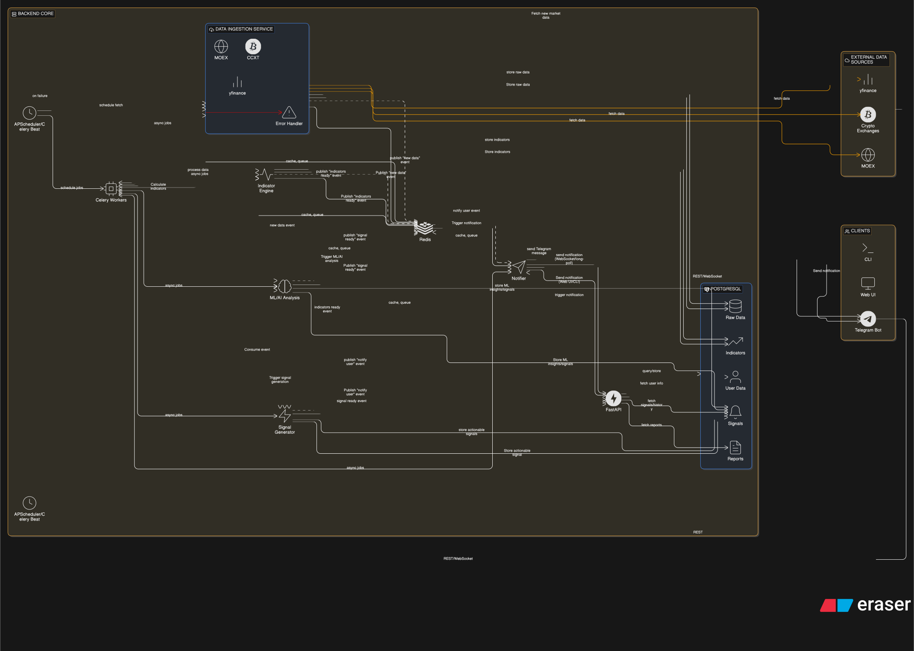
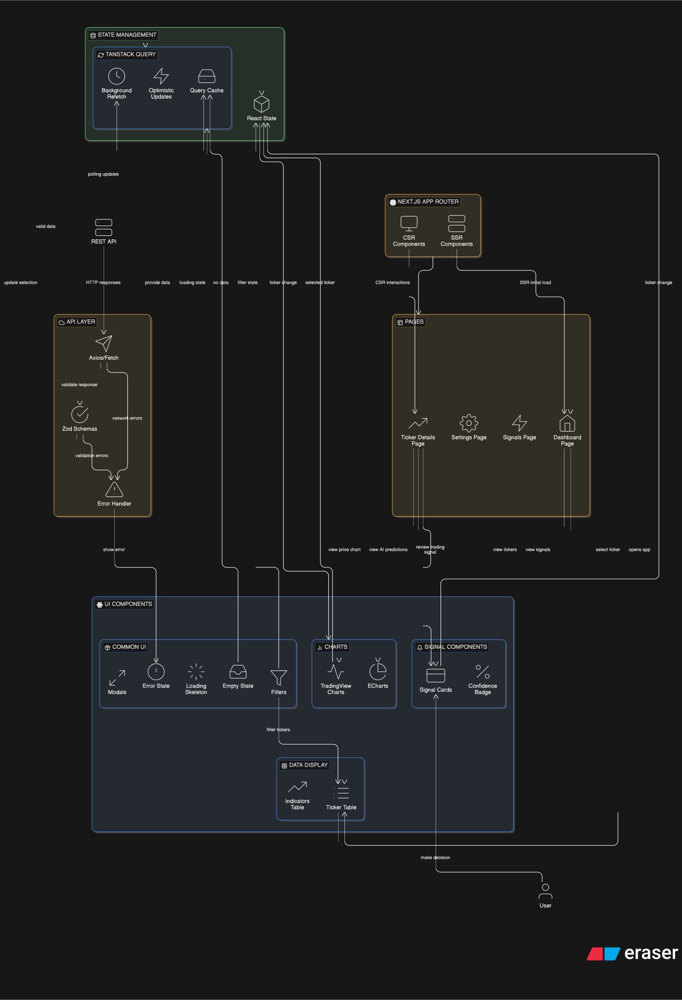
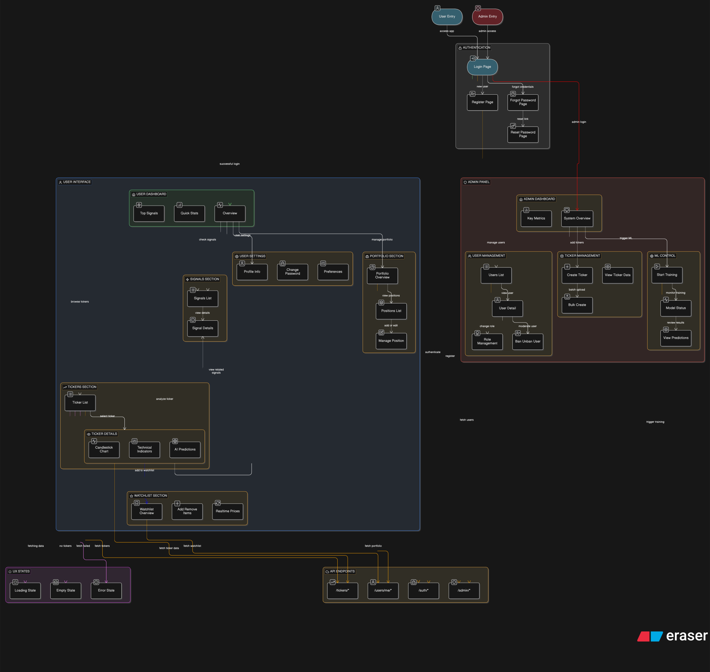

# Все основные скрипты для работы в консоле и UI интерфейсах

## Бизнес-процесс системы
Система представляет собой backend-ядро для анализа финансовых рынков (акции Московской биржи и криптовалюты), которое работает в автоматическом режиме и предоставляет сигналы пользователям через API и клиентские приложения. Схема указана в 

Основной процесс включает следующие этапы:
1. Сбор данных система по расписанию загружает рыночные данные из внешних источников (MOEX, криптобиржи) и сохраняет их в базу данных.
2. Обработка данных на основе полученных данных рассчитываются технические индикаторы (например, RSI, MACD) и формируется обогащённый набор данных для анализа.
3. Анализ с использованием AI/ML подготовленные данные передаются в модели машинного обучения и AI-модули, которые выполняют анализ и прогнозирование рыночных движений.
4. Генерация сигналов на основе результатов моделей и заданных правил формируются торговые сигналы с оценкой достоверности.
5. Хранение результатов исторические данные, рассчитанные индикаторы, сигналы и отчёты сохраняются в системе для последующего использования и анализа.
6. Уведомление пользователей сгенерированные сигналы отправляются пользователям через подключённые клиенты (Telegram-бот, веб-интерфейс, CLI) посредством API.
7. Доступ через API все клиентские приложения взаимодействуют с системой через REST API, обеспечивающий доступ к данным, сигналам и настройкам пользователей.


## Бизнес-процесс пользовательского интерфейса
Пользовательский интерфейс представляет собой веб-приложение (dashboard), обеспечивающее доступ к данным и аналитике системы через API backend-ядра. Схема указана в 

Основной процесс взаимодействия включает следующие этапы:
1. Загрузка данных - при открытии приложения интерфейс запрашивает через API список тикеров, актуальные рыночные данные и торговые сигналы, отображая их в виде таблиц и карточек.
2. Просмотр и анализ активов пользователь выбирает интересующий актив, после чего отображается детальная страница с графиком (свечи), техническими индикаторами и результатами AI-анализа.
3. Работа с сигналами интерфейс показывает сгенерированные торговые сигналы (покупка, продажа, удержание) с указанием вероятности и дополнительной аналитикой.
4. Обновление данных данные автоматически обновляются в фоне (через polling или рефетч), обеспечивая актуальность информации без перезагрузки страницы.
5. Взаимодействие с системой пользователь может настраивать параметры (например, фильтры, предпочтения, уведомления) и получать доступ к историческим данным и аналитике.
6. Обработка состояний интерфейс отображает состояния загрузки, ошибок и отсутствия данных, обеспечивая корректный пользовательский опыт.
7. Интеграция с backend все операции выполняются через API, при этом клиент отвечает за отображение данных, кэширование и управление состоянием.


## Структура страниц и функциональность
Приложение разделено на пользовательскую часть и административную панель, каждая из которых предоставляет доступ к соответствующему функционалу системы через API. Схема указана в 

### Пользовательская часть
- Аутентификация страницы регистрации, входа, восстановления и смены пароля. Обеспечивают доступ к защищённым разделам системы.

- Дашборд главная страница с обзором: список тикеров, актуальные сигналы, краткая статистика и быстрый доступ к основным разделам.

- Тикеры список доступных активов с поиском и фильтрацией.
  Страница тикера включает график (свечи), технические индикаторы и результаты AI-анализа.

- Watchlist пользовательский список избранных активов с актуальными ценами. Поддерживает добавление и удаление тикеров.

- Портфель отображение позиций пользователя, включая добавление, редактирование и удаление активов, а также сводную аналитику.

- Сигналы список торговых сигналов с указанием типа (покупка/продажа/удержание), вероятности и дополнительной аналитики.

- Настройки пользователя управление профилем, смена пароля и пользовательские предпочтения.

### Административная панель

- Дашборд администратора общая информация о системе, пользователях и активности.

- Управление пользователями просмотр списка пользователей, детальная информация, изменение ролей и блокировка/разблокировка.

- Управление тикерами создание и массовое добавление тикеров, просмотр данных по активам.

- Управление ML запуск обучения моделей по тикерам, получение предсказаний и контроль состояния моделей.

### Общие возможности

- Все страницы работают через API backend-системы

- Поддержка асинхронной загрузки данных и фонового обновления

- Обработка состояний загрузки, ошибок и отсутствия данных

- Разграничение доступа (пользователь / администратор)

## Работа с Базой Данных
- Нужно проверить в файле alembic/env.py есть ли строчка
```python
from swingtraderai.db import models
```
1. При первом запуске
```sh
alembic revision --autogenerate -m "Initial migration" // Для инициализации миграций

alembic upgrade head // Для запуска миграций в БД
```

2. Очистки БД и повторный запуск
```sh
rm -rf alembic/versions/ // Для очистки предыдущих миграций

psql -U db_user -h db_host -p db_port -d db_name // Подключаемся к Postgres

\dt+ -- показывает все таблицы в текущей схеме с подробностями.

-- и очищаем все таблицы с помощью DROP TABLE, например...
DROP TABLE IF EXISTS alembic_version;
```
Затем шаг 1

3. Добавление новых миграций
```sh
alembic revision -m "create table"

alembic upgrade head
```

## Работа с Тестированием и Форматирование кода
```sh
source .venv/bin/activate // Активация среды

pytest tests/

black .

ruff check --fix .
ruff format .

mypy .
```
